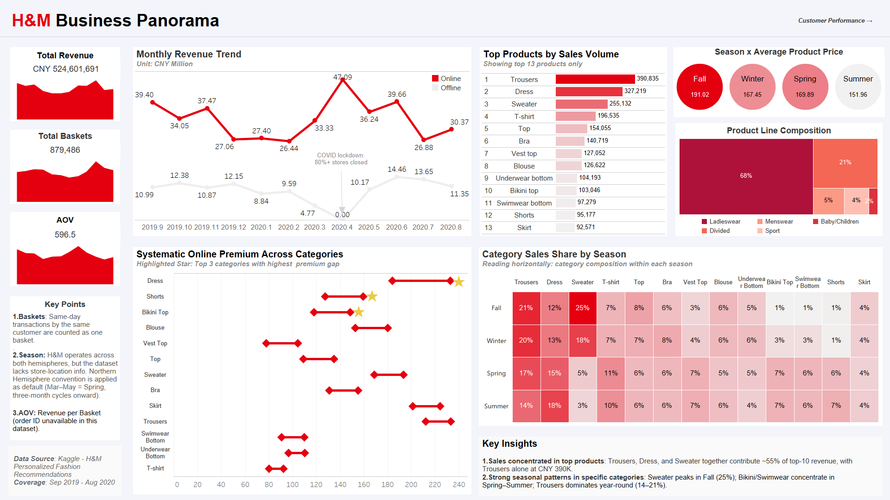
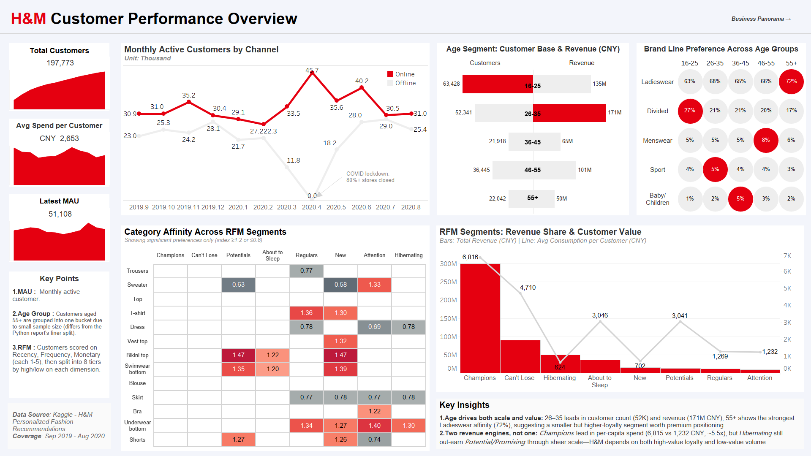
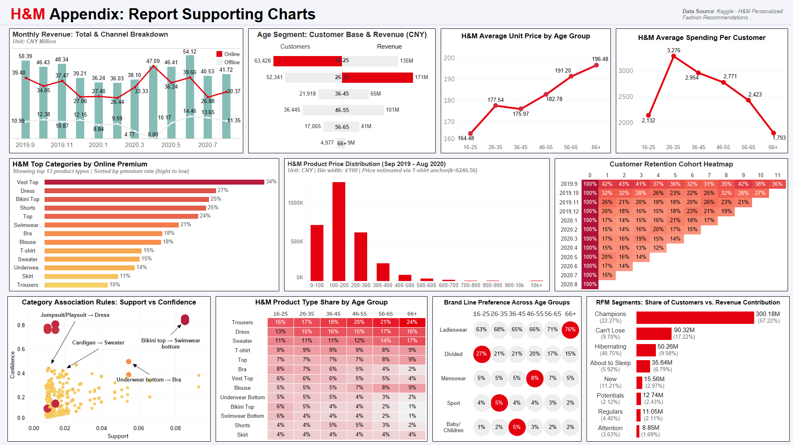

# HM Business and Customer Analysis

### 1.项目介绍

**项目名称：H&M经营分析与客户分层运营**

本项目基于Kaggle官方提供的H&M真实数据集，通过探索性数据分析及RFM模型，得出该数据集时间段内H&M的业务表现与客户分层的观察与分析，并基于这些观察分析提供一些可能的业务建议。







**交互式看板**：[Tableau Public - H&M Business and Customer Analysis Dashboard](https://public.tableau.com/app/profile/ellery.bao/viz/HMBusinessandCustomerAnalysisDashboard/BusinessDashboard)

### 2.项目背景与目标

**背景**：H&M是全球性时尚零售企业H&M集团旗下同名快时尚品牌，数据集涵盖2019年9月至2020年8月交易数据，是观察H&M在线上线下渠道格局关键调整期、突发外部冲击下，业务表现、客群行为、品类偏好与留存表现的难得样本。且根据H&M集团2026年半年报，公司仍延续其核心战略与客群定位，持续推进门店组合的优化；与此同时，H&M品牌线下门店覆盖市场仍多于线上（81 vs. 62）。这一现状与本项目后续基于数据集提出的渠道建议方向一致，因此基于该窗口得出的客户分层、品类偏好、留存模式等洞察，对理解该品牌当下运营仍具有参考价值。 

**目标**：本项目旨在通过 H&M 的交易数据回答以下两个核心业务问题：
- H&M在收入、渠道、品类、季节等维度上呈现哪些业务表现特征？
- 不同价值层级的客户在消费频次、客单价、品类偏好上存在哪些差异，如何针对性运营？

### 3.数据集说明

**数据来源**：[Kaggle - H&M Personalized Fashion Recommendations](https://www.kaggle.com/competitions/h-and-m-personalized-fashion-recommendations)

**数据规模**：本项目使用的数据集由两张维度表customers、articles和一张事实表transactions组成，三表通过customer_id及article_id字段建立关联，通过Python完成数据清洗。原始数据包含约137万客户、11万商品、3178万条交易（时间跨度2018-09至2020-09）。为控制分析规模，本项目随机抽取20%客户(19.7万人)于2019-09至2020-08期间的交易记录（约298万条）作为分析样本。

**特殊处理**：官方未提供sales_channel_id的映射说明，本项目根据2020年4月渠道1销量骤降至零、渠道2同步上升的异常，结合H&M集团半年报披露当月超80%门店关闭，推断1为线下、2为线上。price字段为0-1归一化值，以淘宝H&M官方旗舰店120件T恤的实际售价为外部锚点，与数据集内T恤品类的归一化均价求得还原系数，外推至全表生成estimated_price 字段。分析方法上综合运用RFM客户分层、品类偏好指数矩阵、同期群留存分析与Apriori关联规则挖掘。

### 4.项目文件结构

**技术栈**
- Jupyter Notebook
- Python (pandas, numpy, matplotlib, seaborn, squarify, mlxtend)
- Tableau

**文件结构**
```plaintext
HM-Customer-Analysis/
├── data/                               #原始数据与用于看板制作数据
│   └── README.md
├── notebooks/                           #Jupyter Notebook分析过程
│   └── HM_Business_and_Customer_Analysis.ipynb
├── reports/                             #分析报告
│   └── HM_Business_and_Customer_Analysis.pdf
├── images/                              #Tableau看板静态截图
│   ├── Dashboard_1_Business_Panorama.png
│   ├── Dashboard_2_Customer_Performance.png
│   └── Dashboard_3_Appendix_For_Report.png
├── requirements.txt                     #项目依赖包列表
└── README.md                            #项目说明文档
```

### 5.核心发现

- 核心战略稳定：H&M凭借平价定位积累了一定规模的忠实客群，构成稳定收入基本盘。 
- 渠道互补优势：双线销售渠道为H&M在一定程度上缓解了疫情冲击。 
- 年龄群体差异：26-35岁群体消费能力最强，66岁以上群体呈现“低频高客单”特征。 
- 潜在挖掘市场：41%一般挽留客户仅贡献10%收入，存在较大转化潜力。

### 6.业务建议

- 双线并行的渠道策略：以线上作为主渠道持续投入数字化运营与营销推广，同步筛选优化线下门店结构，保留高价值门店作为社交体验补充与外部风险对冲机制。 
- 分年龄段的产品与营销组合：向26-35岁高价值群体推动冬季保暖款设计升级以挖掘隐性社交消费需求；向16-25岁价格敏感群体倾斜平价内衣的关联捆绑与夏季泳装套装的库存出清；向36-45岁客群植入婴童服装的交叉推荐；为66岁及以上群体推出高品质经典款单品，契合其“低频但高客单”的消费习惯。 
- RFM 分层的客户运营策略：对合计贡献 74%以上收入的重要价值与重要保持客群，通过专属权益与个性化推荐强化留存；对占比 41%但仅贡献 10%收入的一般挽留客群，通过短信、邮件、上新推送等低成本触达尝试召回；对重要唤回客群建立定向挽回通道

### 7.项目局限性

- 本项目由于数据量过大，无法对全部数据进行分析，因此随机筛选了20%产生交易的客户于2019年9月1日至2020年8月31日的交易数据作为分析样本，分析结果在一定程度上可以反映数据集整体的趋势，但可能存在细节上的差异。 
- H&M 在全球各地设有门店，官方未给出明确的地理位置信息，因此本项目默认统一采用北半球时区划分季节。 
- 金额相关数据基于外部锚点还原，仅作趋势参考。

---

**完整报告链接**：完整分析请见 [H&M分析报告(PDF)](reports/HM_Business_and_Customer_Analysis.pdf)

**作者信息**：全恩平，联系邮箱ellerybao@163.com
